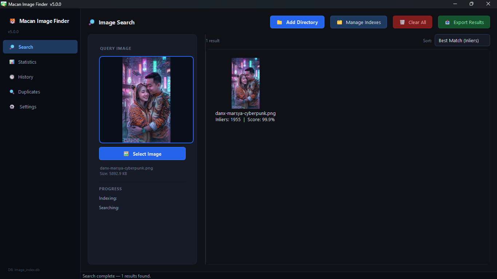
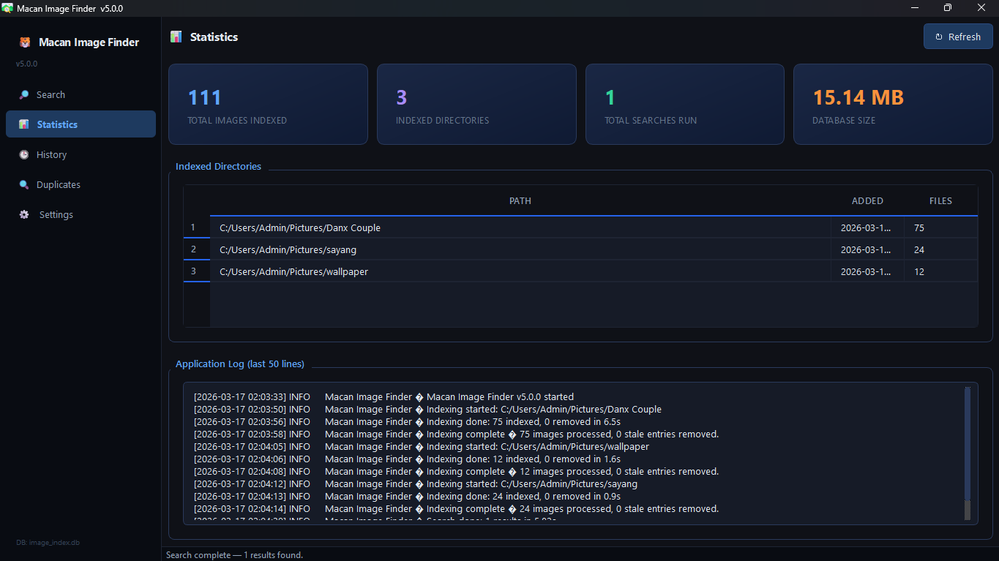
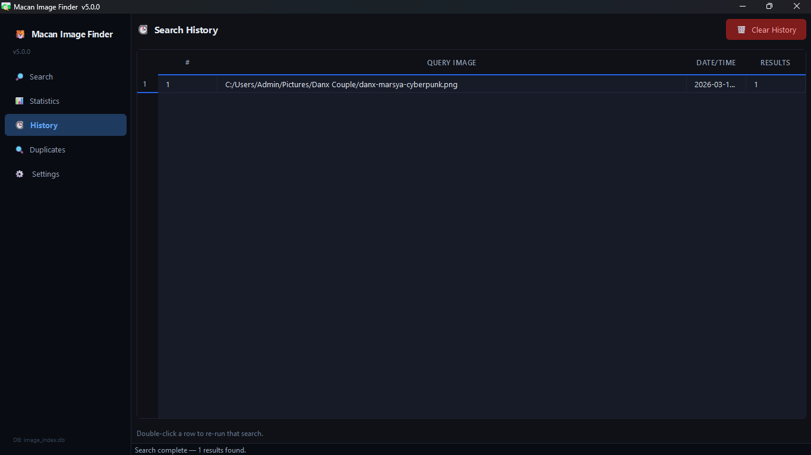
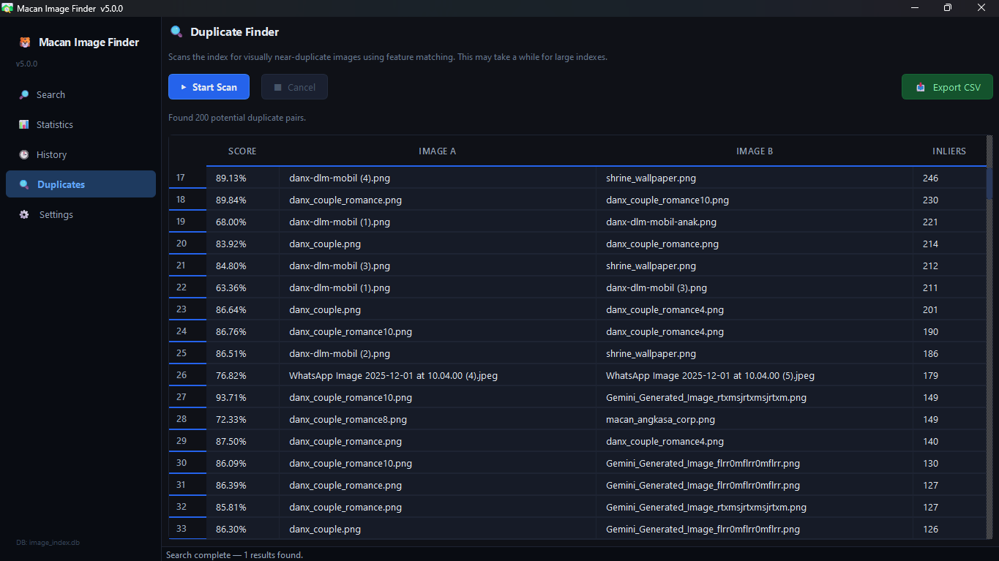
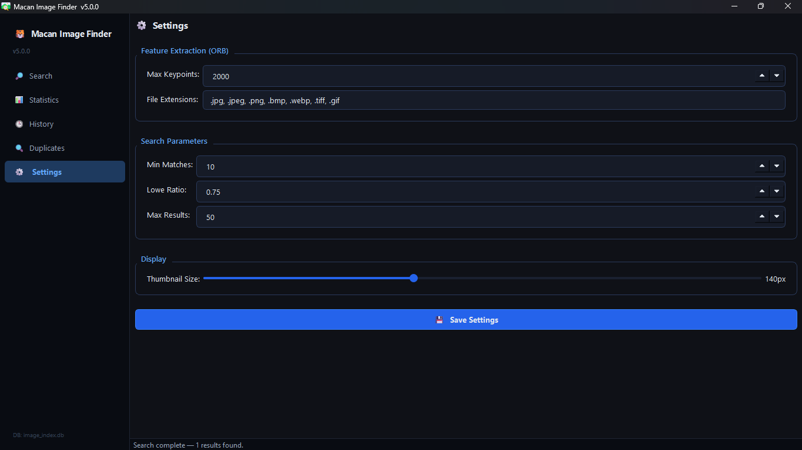

<div align="center">



<br/>

# 🐯 Macan Image Finder

### Enterprise-Grade Reverse Image Search Engine

**Find visually similar images across your local collection — powered by ORB feature extraction + RANSAC homography**

<br/>

[](https://python.org)
[](https://opencv.org)
[](https://doc.qt.io/qtforpython)
[](https://sqlite.org)
[](#license)
[](#)

<br/>

> ⚠️ **Notice:** The source code available in this repository is the **base/basic project version** provided for reference purposes only.
> The **latest release (v5)** with full enterprise features is not publicly distributed.

<br/>

[Features](#-features) · [Screenshots](#-screenshots) · [Installation](#-installation) · [Usage](#-usage) · [Architecture](#-architecture) · [Configuration](#-configuration) · [Contributing](#-contributing)

</div>

---

## 📌 Overview

**Macan Image Finder** is a computer vision–powered desktop application for reverse image search. It allows users to **find visually similar images** from a local collection using a single query image. Built on **ORB (Oriented FAST and Rotated BRIEF)** feature extraction and **RANSAC homography** verification, it accurately detects visual similarity even when images differ in rotation, scale, or lighting conditions.

Designed with a **multi-threaded** architecture and an enterprise-grade **dark-mode UI**, Macan Image Finder is well-suited for digital asset management, duplicate detection, and large-scale visual search workflows.

---

## ✨ Features

### 🔎 Core Search Engine
- **ORB Feature Extraction** — Keypoint detection using FAST detector & BRIEF descriptor
- **RANSAC Homography** — Geometric verification to eliminate false positives
- **Lowe's Ratio Test** — High-quality match filtering with a configurable threshold
- **Configurable Parameters** — Min match count, similarity score, and Lowe ratio are all tunable

### 🗂️ Index Management
- **Multi-Directory Indexing** — Index multiple folders simultaneously
- **Incremental Updates** — Only new or modified images are processed on re-index
- **SQLite Backend** — Lightweight, persistent storage for all feature descriptors
- **Force Re-index** — Regenerate all features for a specific directory on demand
- **Stale Entry Cleanup** — Automatically removes entries for deleted files

### 🖥️ Enterprise UI / UX
- **Dark Mode** — Professional dark theme with a consistent blue enterprise palette
- **Sidebar Navigation** — 5 dedicated pages: Search, Statistics, History, Duplicates, Settings
- **Drag & Drop** — Drop an image directly onto the drop zone to trigger a search
- **Full-Size Viewer** — Double-click any result to open it in a full-size viewer
- **Sortable Results** — Sort by Best Match (Inliers), Score %, or Filename
- **Keyboard Shortcuts** — Fast navigation without leaving the keyboard

### 📊 Analytics & History
- **Statistics Dashboard** — Live view of total indexed images, directories, searches, and DB size
- **Search History** — All past searches are logged with one-click re-run support
- **Duplicate Finder** — Scan the entire index for near-duplicate image pairs

### ⚙️ Configuration
- **Settings Panel** — All parameters configurable through the UI
- **Persistent Settings** — Saved to a `.ini` file via QSettings
- **Adjustable Thumbnail Size** — Slider control for result thumbnail dimensions

### 📤 Export & Integration
- **Export to CSV** — Export search results for use in spreadsheets or pipelines
- **Export to JSON** — Machine-readable output for downstream integration
- **Cancellation Support** — Interrupt any indexing or search operation at any time

### 🔒 Reliability
- **Rotating File Logger** — 5 MB × 3 backup log files written to AppData
- **WAL Journal Mode** — SQLite Write-Ahead Logging for optimal concurrent performance
- **Cross-Platform AppData** — Windows (`%LOCALAPPDATA%`), macOS (`~/Library/Application Support`), Linux (`~/.local/share`)
- **Thread-Safe Database** — Each background worker uses its own dedicated DB connection

---

## 📸 Screenshots

<div align="center">

<table>
  <tr>
    <td align="center">
      
      <br/><sub><b>Search Interface</b></sub>
    </td>
    <td align="center">
      
      <br/><sub><b>Statistic Dashboard</b></sub>
    </td>
  </tr>
  <tr>
    <td align="center">
      
      <br/><sub><b>History</b></sub>
    </td>
    <td align="center">
      
      <br/><sub><b>Duplicate Finder</b></sub>
    </td>
  </tr>
  <tr>
    <td align="center" colspan="2">
      
      <br/><sub><b>Settings Panel</b></sub>
    </td>
  </tr>
</table>

</div>

---

## ⚙️ Installation

### Prerequisites

| Requirement | Version |
|---|---|
| Python | 3.9+ |
| pip | Latest |
| OS | Windows 10/11 · macOS 12+ · Ubuntu 20.04+ |

### 1. Clone the Repository

```bash
git clone https://github.com/danx123/macan-image-finder.git
cd macan-image-finder
```

### 2. Create a Virtual Environment

```bash
# Windows
python -m venv venv
venv\Scripts\activate

# macOS / Linux
python3 -m venv venv
source venv/bin/activate
```

### 3. Install Dependencies

```bash
pip install -r requirements.txt
```

### 4. Run the Application

```bash
python macan_image_finder.py
```

---

## 📦 Dependencies

Save the following as `requirements.txt` in the project root:

```txt
opencv-python>=4.8.0
numpy>=1.24.0
PySide6>=6.5.0
```

---

## 🚀 Usage

### Basic Workflow

```
1. Add Directory  →  Select a folder containing your image collection to index
2. Wait for Index →  Indexing runs in a background thread — progress is shown live
3. Select Image   →  Choose or drag-and-drop a query image onto the drop zone
4. View Results   →  Matching images appear as a scored thumbnail grid
```

### Keyboard Shortcuts

| Shortcut | Action |
|---|---|
| `Ctrl + O` | Open a query image |
| `Ctrl + I` | Add a directory to the index |
| `Ctrl + 1` | Go to Search |
| `Ctrl + 2` | Go to Statistics |
| `Ctrl + 3` | Go to History |
| `Ctrl + 4` | Go to Duplicates |
| `Ctrl + ,` | Open Settings |

### Right-Click Context Menu (on Results)

| Action | Description |
|---|---|
| **View Full Size** | Open the image in a full-size viewer dialog |
| **Open File Location** | Reveal the file in the OS file manager |
| **Copy Path** | Copy the full file path to the clipboard |

---

## 🏗️ Architecture

```
macan-image-finder/
│
├── macan_image_finder.py       # Main application entry point
│
├── Core Components
│   ├── DatabaseManager         # SQLite wrapper — WAL mode, schema migration
│   ├── AppSettings             # QSettings-based persistent configuration
│   ├── IndexingWorker          # QThread worker: ORB extraction + DB write
│   ├── SearchWorker            # QThread worker: BFMatcher + RANSAC filtering
│   └── DuplicateFinderWorker   # QThread worker: pairwise similarity scan
│
├── UI Components
│   ├── ImageSearchApp          # Main window + sidebar navigation
│   ├── DropZoneLabel           # Drag-and-drop image input widget
│   ├── StatsDashboard          # Index statistics & log viewer
│   ├── HistoryPanel            # Search history with re-run support
│   ├── DuplicatePanel          # Duplicate scan UI + CSV export
│   ├── SettingsPanel           # Parameter configuration form
│   ├── ManageIndexesDialog     # Directory index management dialog
│   └── ImageViewerDialog       # Full-size image viewer dialog
│
└── AppData (auto-created at runtime)
    ├── image_index.db          # SQLite feature database
    ├── settings.ini            # User preferences
    └── macan_image_finder.log  # Rotating application log
```

### Search Data Flow

```
Query Image
    │
    ▼
ORB.detectAndCompute()          ←  Extract keypoints & descriptors
    │
    ▼
BFMatcher.knnMatch() ─────────── All features stored in SQLite DB
    │
    ▼
Lowe's Ratio Test               ←  Filter low-quality matches (configurable)
    │
    ▼
cv2.findHomography() + RANSAC   ←  Geometric consistency verification
    │
    ▼
Inlier Count → Similarity Score
    │
    ▼
Sort & Display Top N Results
```

### Database Schema

```sql
-- Stores extracted ORB features for each indexed image
CREATE TABLE features (
    path        TEXT PRIMARY KEY,
    keypoints   BLOB,           -- pickle-serialized cv2.KeyPoint list
    descriptors BLOB,           -- pickle-serialized numpy ndarray
    indexed_at  TEXT DEFAULT (datetime('now'))
);

-- Tracks which directories have been indexed
CREATE TABLE indexed_directories (
    path        TEXT PRIMARY KEY,
    added_at    TEXT DEFAULT (datetime('now')),
    file_count  INTEGER DEFAULT 0
);

-- Search audit trail for the History panel
CREATE TABLE search_history (
    id           INTEGER PRIMARY KEY AUTOINCREMENT,
    query_path   TEXT,
    run_at       TEXT DEFAULT (datetime('now')),
    result_count INTEGER DEFAULT 0
);
```

---

## 🔧 Configuration

All parameters are configurable via the **Settings panel** (`Ctrl + ,`) or by editing `settings.ini` directly.

| Parameter | Default | Description |
|---|---|---|
| `orb/nfeatures` | `2000` | Number of ORB keypoints extracted per image. Higher = more accurate, slower indexing |
| `search/min_match` | `10` | Minimum inlier count required for a result to be considered a match |
| `search/lowe_ratio` | `0.75` | Lowe's ratio test threshold — lower values are more strict (range: 0.50–0.95) |
| `search/max_results` | `50` | Maximum number of results returned per search |
| `ui/icon_size` | `140` | Thumbnail size in pixels for the results grid |
| `index/extensions` | `.jpg,.jpeg,.png,.bmp,.webp,.tiff,.gif` | Comma-separated list of file extensions to index |

### Tuning Tips

- **Prioritize accuracy:** Increase `nfeatures` to 3000–5000 and lower `lowe_ratio` to 0.65
- **Prioritize speed:** Lower `nfeatures` to 500–1000 and raise `lowe_ratio` to 0.80
- **Large indexes (10k+ images):** Use an SSD and set `min_match` to 15+ to reduce false positives

---

## ⚠️ Important Notice — Source Code Version

> The source code available in this repository represents the **base/basic version** of Macan Image Finder, shared for public reference and learning purposes.
>
> The **latest release (v5)** — which includes advanced duplicate detection, a batch export pipeline, enhanced UI components, and additional enterprise-grade features — **is not publicly distributed** and is reserved for internal and commercial use.
>
> For licensing inquiries, please open an issue via [GitHub Issues](https://github.com/danx123/macan-image-finder/issues).

---

## 🤝 Contributing

Contributions to the base version are welcome. Please follow the steps below:

1. **Fork** this repository
2. **Create a feature branch:** `git checkout -b feature/your-feature-name`
3. **Commit your changes:** `git commit -m 'feat: add your feature'`
4. **Push to the branch:** `git push origin feature/your-feature-name`
5. **Open a Pull Request**

### Commit Message Convention

```
feat:      New feature
fix:       Bug fix
perf:      Performance improvement
refactor:  Code restructure with no functional change
docs:      Documentation update
style:     Formatting only, no logic changes
test:      Add or update tests
chore:     Build process or tooling changes
```

---

## 📄 License

This project is licensed under a **Proprietary License**.
The source code available in this repository is provided for reference only and may not be used commercially without explicit written permission.

See the [LICENSE](LICENSE) file for full details.

---

## 🐛 Known Issues & Limitations

- ORB performs poorly on low-texture images (solid colors, clear skies, uniform gradients)
- Search performance degrades significantly for indexes exceeding 50,000 images without additional optimization
- GIF files are indexed using the first frame only
- Very small images (< 100×100 px) may yield insufficient keypoints for reliable matching

---

## 📬 Contact

- **Repository:** [github.com/danx123/macan-image-finder](https://github.com/danx123/macan-image-finder)
- **Issues & Feature Requests:** [github.com/danx123/macan-image-finder/issues](https://github.com/danx123/macan-image-finder/issues)

---

<div align="center">

<br/>

Made with ❤️ and 🐯 spirit

<br/>

---

**© 2026 Macan Angkasa — All Rights Reserved**

*Unauthorized reproduction or distribution of this software, in whole or in part, is strictly prohibited.*

</div>
